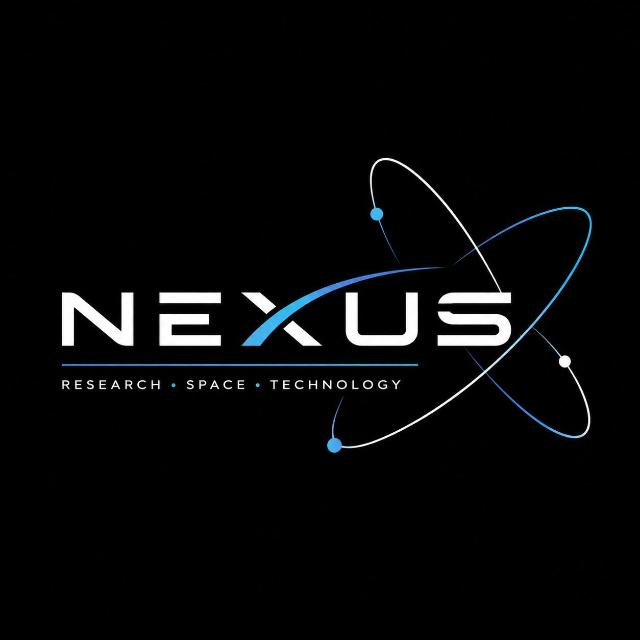

# 🚀 NEXUS Among Us Dashboard

<div align="center">



<br/>


<br/>

### 🚨 **NEXUS IS BRINGING THE CHAOS!** 🚨
**Ready to put your brains, instincts & detective skills to the test? 👀🔥**

[🕹️ Coded Chaos Registration](https://tinyurl.com/bdfp2emu) • [🕵🏻‍♀️ Tech Mystery Registration](https://tinyurl.com/45sbus6m) • [Vercel Guide](./docs/DEPLOYMENT_VERCEL.md) • [Supabase Guide](./docs/SUPABASE_SETUP.md) • [Contributing](./CONTRIBUTING.md)

</div>

---

## 🎁 Special Event Announcement

> ### 🎁 **REGISTER FOR ONE EVENT & GET THE SECOND EVENT ABSOLUTELY FREE!** 🎁
>
> **Yes, you read that right. ONE REGISTRATION = TWO EVENTS! 🤯🔥**
> 
> So grab your team, register NOW and get ready for a day full of chaos, clues, challenges & competition!
> 
> 📌 **Don’t miss out. Register now!**  
> ⚡ **Two events. One registration. Double the fun.** ⚡

| Event | Focus | Registration Link |
|---|---|---|
| 🕹️ **CODED CHAOS** | *Among Us: Coded Chaos* — Physical & digital station tasks, sabotages, and impostor deduction | [Register Here](https://tinyurl.com/bdfp2emu) |
| 🕵🏻‍♀️ **TECH MYSTERY** | *Can you crack the mystery?* — Forensic riddles, cipher decoders, and digital evidence cases | [Register Here](https://tinyurl.com/45sbus6m) |

---

## 📖 Overview

The **NEXUS Among Us Dashboard** is an enterprise-grade real-time operations and gameplay platform engineered by the **NEXUS Club** to orchestrate two simultaneous competitive flagship events:
1. **Coded Chaos (Among Us Arena)**: Physical & digital sector rooms, squad allocations, 3-port Impostor power execution, sabotage alarms, hostile effect action locks, and emergency meeting protocols.
2. **Tech Mystery (Detective Arena)**: Evidence dossiers, forensic decoding terminal, cipher flag verification (ROT13, Base64, Hexadecimal, Binary).
3. **Operations Console**: High-efficiency black & white administrative interface for managing sector rooms, squads, player rosters, staff accounts (Master Admin, Station Admin, Moderator), and telemetry audit logs.
4. **Player Login & Terminal**: Dedicated squad login gateway (`frontend/index2.html`) and station terminal (`frontend/player.html`) displaying role detection, hostile threat status, and 3-port power console.

---

## 📂 Repository Structure

This repository is structured as a monorepo configured for seamless multi-developer club collaboration:

```
Nexus-Among-Us-Dashboard/
├── .github/                      # GitHub Collaboration & Automation
│   ├── workflows/ci.yml          # GitHub Actions CI build & verification
│   ├── ISSUE_TEMPLATE/           # Structured bug, feature, and task templates
│   ├── PULL_REQUEST_TEMPLATE.md  # Standardized PR checklist
│   └── CODEOWNERS                # Sub-team code ownership routing
├── assets/                       # Official NEXUS Brand Logos & Visual Assets
│   └── nexus-logo.jpeg           # High-resolution club insignia
├── supabase/                     # Supabase Cloud Database & Realtime Engine
│   ├── schema.sql                # Complete PostgreSQL tables, indexes & RLS policies
│   └── seed.sql                  # Initial Skeld station tasks & Tech Mystery dossiers
├── backend/                      # Node.js + Express + TypeScript + Socket.IO
│   ├── src/
│   │   ├── config/supabase.ts    # Supabase service-role client
│   │   ├── controllers/          # Route business logic (teams, game, mystery, admin)
│   │   ├── models/               # TypeScript interfaces & initial match mock data
│   │   ├── routes/               # Express REST route endpoints
│   │   ├── services/             # Game engine, sabotage alarms, scoring
│   │   ├── sockets/              # Socket.IO client/server event handlers
│   │   └── index.ts              # Server entry point
│   ├── package.json
│   └── tsconfig.json
├── frontend/                     # React 18 + Vite + TypeScript + Tailwind CSS (Vercel-Ready)
│   ├── public/logo.jpeg          # App favicon and branding
│   ├── src/
│   │   ├── lib/                  # AllocationDatabase, Supabase client
│   │   ├── components/           # UI components, modals, HUD widgets
│   │   ├── pages/                # Admin Console (AmongUsAdmin.tsx), Hub, Mystery
│   │   ├── types/                # Shared frontend TypeScript interfaces
│   │   ├── App.tsx               # Main application routing & event hub
│   │   └── main.tsx              # React mounting root
│   ├── index.html                # Admin Operations Console entry point
│   ├── index2.html               # Player authentication login portal
│   ├── player.html               # Live player station terminal ("To be made by backend team")
│   ├── package.json
│   └── vite.config.ts
├── docs/                         # Team Documentation & Playbooks
│   ├── ARCHITECTURE_AND_INTEGRATION_GUIDE.md # Exhaustive technical architecture & backend blueprint
│   ├── ARCHITECTURE.md           # System design & WebSocket event protocol
│   ├── API_SPECS.md              # REST & WebSocket endpoint specifications
│   ├── SUPABASE_SETUP.md         # Supabase PostgreSQL & Realtime setup guide
│   ├── GAME_RULES.md             # Official competition rules & 3-port power mechanics
│   ├── TASK_BOARD.md             # Module tracking & developer task distribution
│   ├── EVENT_INFO.md             # NEXUS promotional kit & links
│   └── DEPLOYMENT_VERCEL.md      # Vercel deployment walkthrough
├── vercel.json                   # Root Vercel deployment configuration
├── docker-compose.yml            # Multi-container Docker orchestration
├── CONTRIBUTING.md               # Club contributor guidelines
├── CODE_OF_CONDUCT.md           # Contributor Covenant v2.1
├── SECURITY.md                   # Security vulnerability reporting
├── LICENSE                       # MIT License
└── package.json                  # Root runner script for frontend + backend
```

---

## 👥 Multi-User Collaboration Guide

To ensure everyone can develop smoothly without merge conflicts or overlapping code:

1. **Read the Guides**:
   - Check [GIT_WORKFLOW.md](./docs/GIT_WORKFLOW.md) for branch naming (`feat/frontend-...`, `feat/backend-...`).
   - Check [TASK_BOARD.md](./docs/TASK_BOARD.md) to claim an unassigned task.
2. **Never push directly to `main`**:
   - Always branch off `main`: `git checkout -b feat/your-feature`
   - Keep commits descriptive: `feat(frontend): add sabotage alarm HUD`
3. **Submit a Pull Request**:
   - Push to your branch and open a PR using the [Pull Request Template](./.github/PULL_REQUEST_TEMPLATE.md).
   - Tag reviewers from the team.

---

## ⚡ Quickstart & Local Setup

### Prerequisites
- **Node.js**: v18.0.0 or higher (v20+ recommended)
- **npm**: v9.0.0 or higher
- **Git**

### 1. Clone the Repository
```bash
git clone https://github.com/Tejas-Narula/Nexus-Among-Us-Dashboard.git
cd Nexus-Among-Us-Dashboard
```

### 2. Install All Dependencies
Install dependencies across root, backend, and frontend with a single command:
```bash
npm run install:all
```

### 3. Configure Environment Variables
Copy the sample environment files:
```bash
# Backend configuration
cp backend/.env.example backend/.env

# Frontend configuration
cp frontend/.env.example frontend/.env
```

### 4. Run Development Servers Concurrently
Start both the Express backend (`http://localhost:5000`) and Vite frontend (`http://localhost:5173`) together:
```bash
npm run dev
```

Alternatively, you can run services individually:
```bash
# Run backend only
npm run dev:backend

# Run frontend only
npm run dev:frontend
```

---

## ☁️ Cloud Hosting & Database Setup

### 1. 🗄️ Supabase PostgreSQL & Realtime
1. Create a project at [supabase.com](https://supabase.com).
2. In the **SQL Editor**, run [`supabase/schema.sql`](./supabase/schema.sql) to create tables, RLS policies, and realtime publication.
3. Run [`supabase/seed.sql`](./supabase/seed.sql) to populate initial station tasks and mystery dossiers.
4. Copy `Project URL` and `anon key` to your `.env`.
> 📖 Detailed guide: [docs/SUPABASE_SETUP.md](./docs/SUPABASE_SETUP.md)

### 2. ▲ Vercel Hosting (One-Click)
1. Import this repository into [Vercel](https://vercel.com/new).
2. Set Framework Preset to **Vite** (Root `vercel.json` and `frontend/vercel.json` handle rewrites automatically).
3. Add Environment Variables:
   - `VITE_SUPABASE_URL`
   - `VITE_SUPABASE_ANON_KEY`
4. Click **Deploy**!
> 📖 Detailed guide: [docs/DEPLOYMENT_VERCEL.md](./docs/DEPLOYMENT_VERCEL.md)

---

## 🐳 Docker Deployment

To spin up the entire production stack (Frontend + Backend) with Docker:
```bash
docker-compose up --build
```
- Access Frontend: `http://localhost:5173`
- Access Backend API: `http://localhost:5000/api/health`

---

## 📡 Core API Summary

Detailed specifications are available in [API_SPECS.md](./docs/API_SPECS.md).

| Method | Endpoint | Description |
|---|---|---|
| `GET` | `/api/health` | Service uptime and health diagnostics |
| `GET` | `/api/teams` | Retrieve leaderboard and registered squads |
| `POST` | `/api/teams/register` | Register squad for bundled dual-event pass |
| `GET` | `/api/game/state` | Current match state, tasks, sabotage status |
| `POST` | `/api/game/tasks/:id/complete` | Mark station task complete |
| `POST` | `/api/game/emergency` | Trigger Emergency Meeting siren |
| `GET` | `/api/mystery/clues` | Retrieve Tech Mystery forensic case dossiers |
| `POST` | `/api/mystery/verify` | Submit decrypted cipher flag |
| `POST` | `/api/admin/sabotage` | Trigger or resolve sabotage (Reactor/O2/Lights/Comms) |

---

## 🛡️ License & Credits

- Built by the **NEXUS Club Core Technical Team** for the 2026 NEXUS Annual Tech Fest.
- Released under the [MIT License](./LICENSE).
